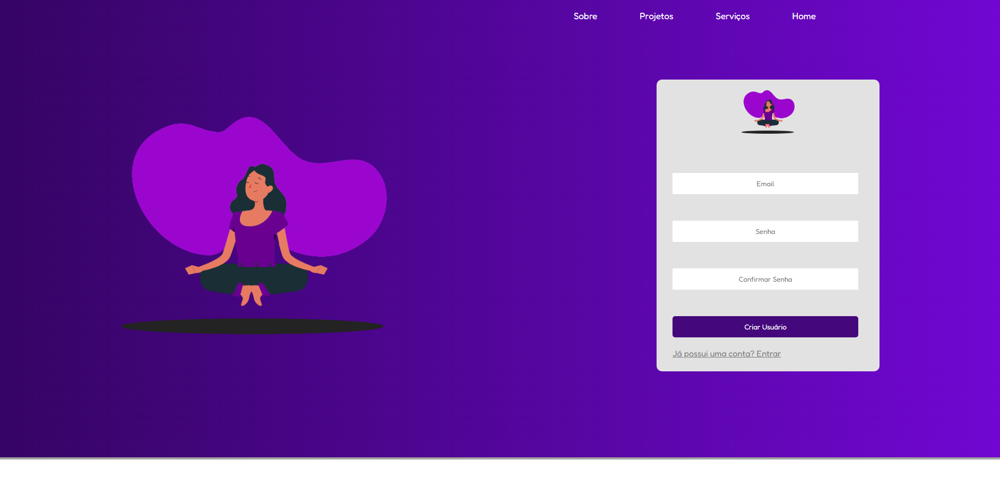
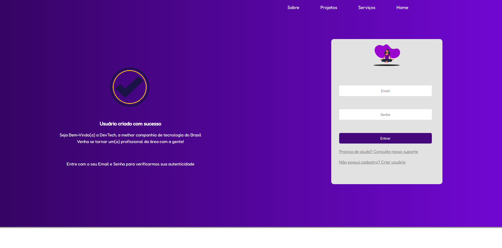
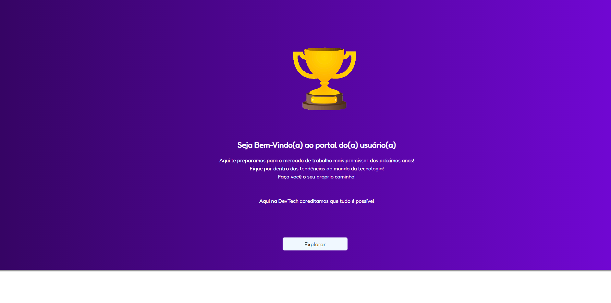

<h1>[PROJECT UNDER MAINTENANCE...]</h1>

  

This project will undergo some changes in its architecture

  

<h2> This is the home page </h2>

 This is the first image a non-logged-in customer sees when entering the site. 

 

 

 

<h2> Created a new user </h2>

 Next page when the customer creates a new user, for confirmation the customer must enter his data again. 

 

 

 

<h2> Portal user </h2>

 After this user enters his data and confirms his email and password, he will be redirected to this page, which would be more or less the simulation of a user portal. 

 

  

- <strong> NOTE: The password and password confirmation are saved in the already encrypted database. </strong>

 

- <strong> Coming soom: Responsive website </strong>

- <strong> Coming soom: URL Project </strong>

 

Contribuidor do projeto - (Diógenes Ribeiro de Oliveira) - [Visit my Linkedin](https://www.linkedin.com/in/diogenesriboliveira/)
