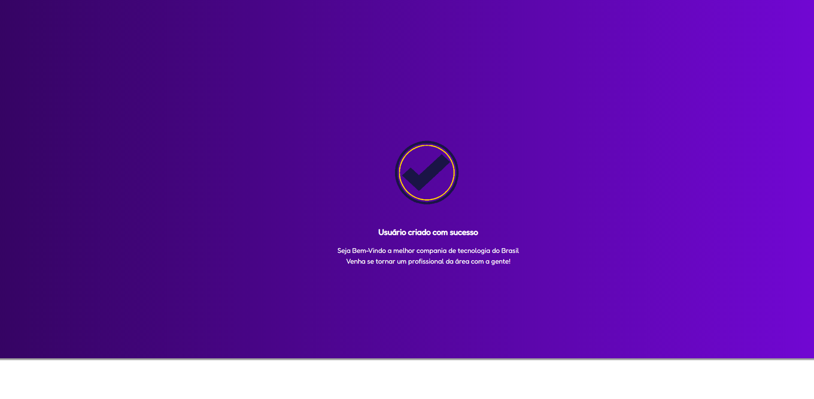

<h3 align='center'> Abaixo temos a imagem da tela principal </h3>

 

 

<h3 align='center'> Abaixo temos um campo para usuários que já possuem um cadastrado </h3>

 

 

<h3 align='center'> Abaixo temos um template de quando o cliente cria um novo usuário </h3>

 

  

 A partir do momento em que o cliente entra com uma requisição para criar um novo usuário, ele é redirecionado para um template de boas vindas. Como vista acima! 

   

Contribuidor do projeto - (Diógenes Ribeiro de Oliveira) - [Visit my Linkedin](https://www.linkedin.com/in/diogenesriboliveira/)